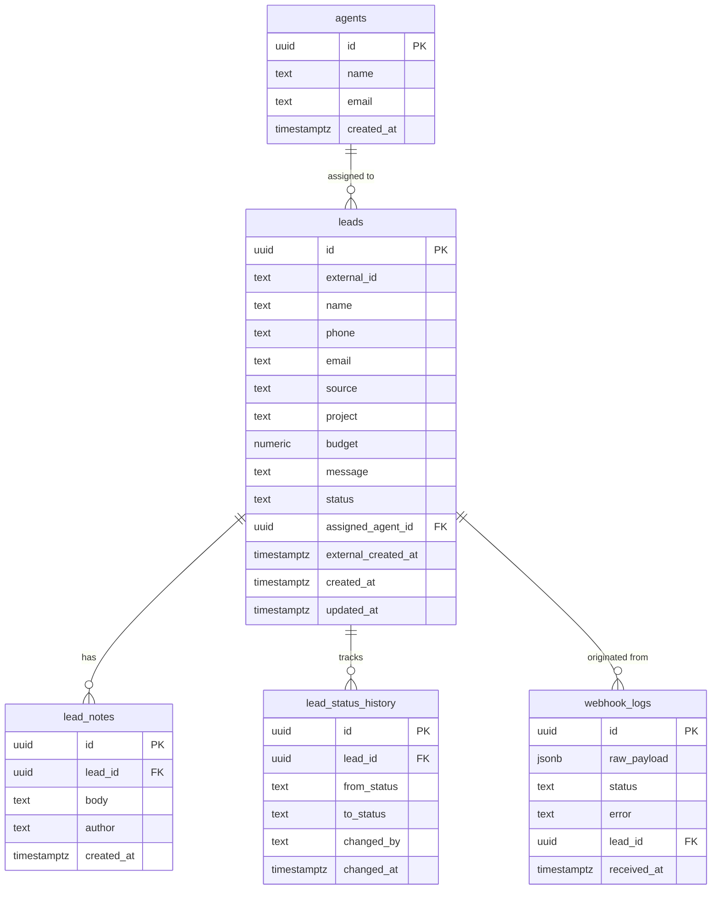

# Entity Relationship Diagram

```mermaid
erDiagram
    agents {
        uuid id PK
        text name
        text email
        timestamptz created_at
    }

    leads {
        uuid id PK
        text external_id
        text name
        text phone
        text email
        text source
        text project
        numeric budget
        text message
        text status
        uuid assigned_agent_id FK
        timestamptz external_created_at
        timestamptz created_at
        timestamptz updated_at
    }

    lead_notes {
        uuid id PK
        uuid lead_id FK
        text body
        text author
        timestamptz created_at
    }

    lead_status_history {
        uuid id PK
        uuid lead_id FK
        text from_status
        text to_status
        text changed_by
        timestamptz changed_at
    }

    webhook_logs {
        uuid id PK
        jsonb raw_payload
        text status
        text error
        uuid lead_id FK
        timestamptz received_at
    }

    agents ||--o{ leads : "assigned to"
    leads ||--o{ lead_notes : "has"
    leads ||--o{ lead_status_history : "tracks"
    leads ||--o{ webhook_logs : "originated from"
```
