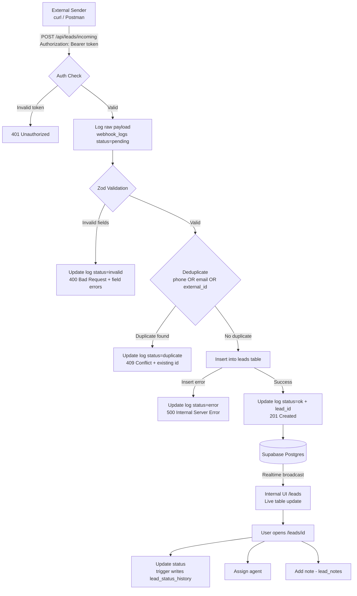

# System Flowchart

```mermaid
flowchart TD
    A[External Sender<br/>curl / Postman] -->|POST /api/leads/incoming<br/>Authorization: Bearer token| B{Auth Check}
    B -->|Invalid token| C[401 Unauthorized]
    B -->|Valid| D[Log raw payload<br/>webhook_logs status=pending]
    D --> E{Zod Validation}
    E -->|Invalid fields| F[Update log status=invalid<br/>400 Bad Request + field errors]
    E -->|Valid| G{Deduplicate<br/>phone OR email OR external_id}
    G -->|Duplicate found| H[Update log status=duplicate<br/>409 Conflict + existing id]
    G -->|No duplicate| I[Insert into leads table]
    I -->|Insert error| J[Update log status=error<br/>500 Internal Server Error]
    I -->|Success| K[Update log status=ok + lead_id<br/>201 Created]
    K --> L[(Supabase Postgres)]
    L -->|Realtime broadcast| M[Internal UI /leads<br/>Live table update]
    M --> N[User opens /leads/id]
    N --> O[Update status<br/>trigger writes lead_status_history]
    N --> P[Assign agent]
    N --> Q[Add note - lead_notes]
```
